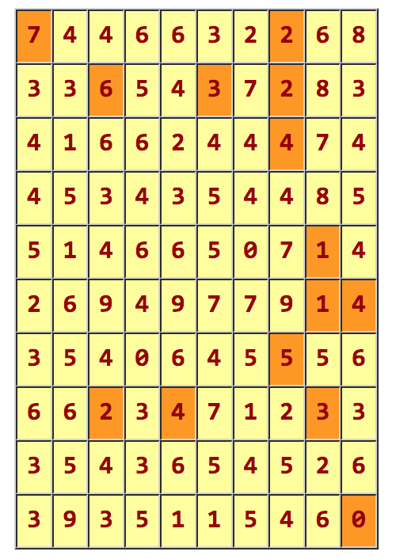

# Polyglot Programming Coursework

To be completed using the Kotlin programming language.
----

## Purposes of this assignment:
- Provide you with more experience of using the Kotlin programming language. 
- Give you further exposure to the (so called) polyglot programming paradigm. 
- Familiarise you with (some of) the Kotlin API.
- To provide a bit of fun...

## Overview
Write a program to read in, and solve, path-finding puzzles. A puzzle consists of an N × N array of integers:



The problem is as follows:

1. Starting in the upper left-hand corner (location 0, 0),
2. Find a sequence of moves that takes you to the bottom right-hand corner (for an N × N
   array, this would be location N − 1, N − 1).
3. From each location in the array you may move *left*, *right*, *up*, or *down*; the number in the 
   location tells you exactly how far to move.
   
For example, with the board configuration shown above, location (0, 0) contains a 7, so from that position 
you must move exactly seven squares, either to the *right* or *down* (you are not allowed to move off of the board).

To help you see the solution, the squares along the solution path have been coloured orange. 
(Originally we wrote arrows on the board to show the path but that got too messy.) 
From 7 you move right to 2, down to 4, down to 5, up to 5, etc. The complete solution is:
```
((0, 0), (0, 7), (2, 7), (6, 7), (1, 7), (1, 5), (1, 2),
 (7, 2), (7, 4), (7, 8), (4, 8), (5, 8), (5, 9), (9, 9))
```
That is,
```
Right Down Down Up Left Left Down Right Right Up Down Right Down
```

## The Details of the problem

You **can** assume:

- The puzzle is square (not just rectangular).
- The number at position 0, 0 is non-zero.
- There are no negative numbers in the puzzle.
- There is at least one solution.

You **must not** assume:

- There is any particular number in the goal location. (If you can get there, it’s irrelevant what number it contains.)
- There are no zeros in the array. (There might be, and if you go there you are stuck.)
- There is a legal move from every location in the array. (The above array might contain a 20, for example.)
- There is only one solution. (In the case of multiple solutions, we will accept any correct solution.)
- There are no cycles.

*Please note*: You are not allowed to change the numbers in the array.

Use `Puzzle` as the name of the object containing your `main` function. Use additional
classes, objects, and methods as you see fit.

## Solution

There are two basic ways to solve a problem of this type and both use techniques we will have 
examined in the logic programming section of the module (hence, don't start the assignment too early):

- **Use backtracking**:

  When you reach a location from which you cannot move, or which you have been to before, *backtrack* 
  and try another direction.
- **Use nondeterminism**:
  
  At each choice point, go all possible ways, and keep track of all the paths that result.
  Stop exploring any path from which you cannot move, or which takes you to a previous location along this path.
  
You should provide a comprehensive set of unit tests for your code.


## Notes

You should use a `JFileChooser` to *read in* the puzzle; we want to see interoperability with Java.
There is a `chooseFile` function in the provided files that you can use as a model.
The input file will consist of `n` lines, where each line represents a single row. 
Each line will contain `n` non-negative integers, separated by single spaces, with no leading or trailing spaces.

You should write your program to solve one puzzle and then quit; there is no need to ask the user whether 
s/he wishes to solve additional puzzles.
You are not required to use a Kotlin `Array`; feel free to use a `List` or any other data structure that you prefer.
The solution should be printed out in one of the two formats shown above (your choice).

As always, ensure you have a regular and complete commit history for each repository.

## Additional grading considerations

In addition to the usual grading criteria you should also consider the following.

Remember that clarity and conciseness are highly correlated. In other words, short programs are usually 
(but not always) easier to understand than long programs. 
Your goal should almost always be to write the clearest, most easily understandable program that you can.

There are some things you should know about Kotlin style. While we will not be grading on Kotlin-specific style, 
you will find that your program is easier to write and debug if you make some attempt to follow these suggestions.

- Use `val` rather than `var` whenever possible.
- Prefer recursion to loops.
- Prefer calls of *higher-order-functions* to recursion.
- Use *null safety* except when interacting with Java classes/libraries. 
- Prefer `when` to nested `if` statements.

## Credits

The specification for this coursework was developed with, and based upon, an original assignment by David Matuszek, 
at the University of Pennsylvania, which, I believe, is based upon a coursework from Stanford, which is 
based upon a coursework from . . .

